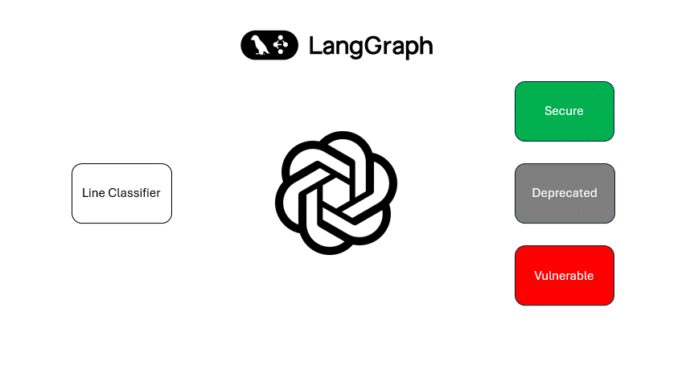

# Co-Hacker Server Repository


## The Co-Hacker VSCode Extension

This repository contains a FastAPI backend service for the [Co-Hacker](https://github.com/HeapHopper/co-hacker) VSCode extension. It is not just a REST query router; it is first and foremost where the AI models, prompts, and structured queries are defined and implemented.

Co-Hacker is a co-pilot extension made by developers for developers, aiming to find software insecurities during development—before compilation and/or runtime—by providing "on-the-fly" solutions to vulnerable code.

In practice, the VSCode extension is a simple client-side logic that extracts code selections to be examined and replaces vulnerable code with secure alternatives. It does not have any direct contact with the LLM itself and is unaware of any AI agent behavior.

Queries from the VSCode extension are routed to their designated endpoints in this server, where each request for automatic or manual code analysis is processed using the appropriate LLM model (not to be confused with `BaseModel`), with a prompt specifying the secure-code mission.

This service is hosted online on [railway.app](https://railway.app/).

## Working Principle

Co-Hacker supports several features—some automatic and some manual—but the working principle for assessing code security, generating fix suggestions, and applying them back to the user code is the same for all cases.

To make things more tangible, we will follow the `inline_assistant` feature, which is an automatic mechanism to find code vulnerabilities in a specific line of code. The process milestones are the same for all other features.

### Model

Each use case starts with a strict model for the feature's request and response properties:

```python
class InlineAssistantRequest(BaseModel):
    current_line: str
    current_scope: str
    current_file: str

class InlineAssistantResponse(BaseModel):
    is_vulnerable: bool
    vulnerability: Vulnerability
    suggest_fix: str
```

For `inline_assistant`, the server expects to receive the current line of code, along with the current scope (`{}`) and the current file. This data should be sufficient to determine whether the line has a potential security risk.

In return, the service provides the following information: whether the code is secure, if not, what the vulnerability is, and how it can be fixed. These properties are later used by the client (the VSCode extension) to modify the code or present warnings/solutions in the editor.

### Prompt

After defining the request and response schema, it is time to create a prompt that will generate the desired response based on the given request. The "Prompt" step is composed of three parts:

#### 1. LLM Definition

For example:

```python
inline_assistant_llm = ChatOpenAI(
    model='gpt-4.1-nano',
    api_key=OPENAI_API_KEY
)
```

The `inline_assistant` uses the `nano` model for fast, "real-time" response latency.

#### 2. Prompt Templates

Using [langchain](https://www.langchain.com/) module objects like `HumanMessagePromptTemplate`, `SystemMessagePromptTemplate`, etc., we create a prompt (single or chain) for the task of inline code assistance.

The prompt refers to data given in the request model, for example:

```python
INLINE_ASSISTANT_USER_PROMPT = HumanMessagePromptTemplate.from_template("""
You are a C/C++ inline code assistant ... focusing on vulnerability detection and secure code.
                                                                        
Start by analyzing the current line of code:
```{line}```
                                                                        
The current scope is also provided for context:
```{scope}```
""")
```

The prompt also mentions the response model:

```python
"""
The output should include:
- is_vulnerable: true or false
- vulnerability:
    - description: a brief description of the vulnerability
    - vulnerable_code: the specific code that is vulnerable
- suggest_fix: ONLY the fixed C/C++ code that addresses the vulnerability.
"""
```

This step is completed with a `ChatPromptTemplate` instance, provided by `langchain`, for making an LLM-specific prompt instance.

#### Creating Runnable

Using `langchain.Runnable`, the previous prompt templates are now an action that can be run to generate a structured response:

```python
inline_assistant_chain: Runnable = inline_assistant_prompt | inline_assistant_llm.with_structured_output(InlineAssistantResponse)
```

### Graph

We finished the last step with a `langchain.Runnable` instance. Using `invoke()`, we can send a structured query to the LLM and use the results. However, one important thing is missing for production: tracing.

The "Graph" step has two tasks:

#### Traceable Nodes

Each runnable should have its own "node"—a function that wraps the `invoke()` method with the given request and response data. This node is traced using the `traceable` decorator from the `langsmith` module:

```python
# LangGraph-compatible state
class InlineAssistantGraphState(BaseModel):
    input: InlineAssistantRequest
    output: InlineAssistantResponse | None = None  

# Single-node LangGraph
@traceable(name="inline_assistant", description="Inline code assistant for C/C++ vulnerabilities")
def inline_assistant_node(state: InlineAssistantGraphState) -> dict:
    result = inline_assistant_chain.invoke({
        "line": state.input.current_line,
        "scope": state.input.current_scope,
        "file": state.input.current_file
    })
    return {"output": result}
```

#### Build Complex Graph

Using `langgraph`, we can orchestrate a set of nodes into a structured graph, connecting `Runnable` actions to build more targeted and intelligent workflows.

In the inline assistant feature, several `Runnable` functions are defined as nodes in the graph:

```python
builder.add_node("initial_classifier", initial_classifier_node)
builder.add_node("handle_safe", handle_safe_node)
builder.add_node("handle_vulnerable", handle_vulnerable_node)
builder.add_node("check_scope", check_scope_node)
builder.add_node("check_file", check_file_node)
builder.add_node("suggest_std_upgrade", suggest_std_upgrade_node)
```

Each code snippet is classified as **Safe**, **Vulnerable**, or **Deprecated** (meaning it is currently secure but should be updated to a newer standard).

The graph starts by analyzing the current line of code in isolation. If a confident classification can't be made, it expands the context to the surrounding scope. If it's still uncertain, it escalates to analyzing the entire file:



This behavior is controlled by defining **edges** between nodes. For example, here’s how the edge logic for the `check_scope` node is implemented. It determines the next node (`Runnable`) to activate based on the model's suggestion or the associated `confidence_level`:

```python
builder.add_conditional_edges(
    "check_scope",
    lambda state: (
        "handle_vulnerable" if state.suggestion_type == "vulnerable" else
        "suggest_std_upgrade" if state.suggestion_type == "std_upgrade" else
        "handle_safe" if state.confidence_level >= 0.66 else
        "check_file"
    )
)
```

### Route

The "Route" is simply the FastAPI endpoint handling requests from the VSCode extension.
Its task is to invoke the `StateGraph` to create the response:

```python
@router.post("/", response_model=InlineAssistantResponse)
async def inline_assistant(input: InlineAssistantRequest):
    try:
        result_state = inline_assistant_graph.invoke(InlineAssistantGraphState(input=input))
        return result_state['output']
    except Exception as e:
        raise HTTPException(status_code=500, detail=str(e))
```

All the different feature routes are aggregated into the app router, creating a combined service that can be hosted as a single app.

## Summary of Used Technologies

### Routing

In the context of plain Python modules, it is worth mentioning `pydantic` and `fastapi` for implementing the routing logic and defining request/response interfaces.

### Hosting Service

The application is hosted online by [railway.app](https://railway.app/) services.

### LLM Framework

- `langchain` – for creating structured queries and runnable objects
- `langsmith` – for tracing LLM queries
- `langgraph` – for composing traceable nodes into a state graph for more targeted solutions

